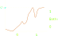

theme: ../cleaver-light

---

# How2hardware 

--
# Introduction to electronics

--
### Ohms Law

- More voltage -> More current


--
### Ohms Law

- More voltage -> More current
- More resistance -> Less current


--
### Ohms Law

- More voltage -> More current
- More resistance -> Less current

But, we don't really have to care. In digital circuits, voltage is all that matters


--
### Voltage

Disclaimer: i'm simplifying, physicists may get angry.


--
### Voltage

- Voltage is a measure of electric potential

--
### Voltage

- Voltage is a measure of electric potential
- High voltage -> flow of charge (current) to lower voltage

--
### Voltage

- Voltage is a measure of electric potential
- High voltage -> flow of charge (current) to lower voltage
- Everything is relative, including voltage
- We choose what a "high" voltage is by chosing what 0 volts is

--
### Voltage

- Voltage is a measure of electric potential
- High voltage -> flow of charge (current) to lower voltage
- Everything is relative, including voltage
- We choose what a "high" voltage is by chosing what 0 volts is
- The zero point is called "ground", because the earth can absorbe any charge us puny humans throw at it

--
### Voltage

- Voltage is a measure of electric potential
- High voltage -> flow of charge (current) to lower voltage
- Everything is relative, including voltage
- We choose what a "high" voltage is by chosing what 0 volts is
- The zero point is called "ground", because the earth can absorbe any charge us puny humans throw at it
- Voltage is meaningless uneless there is a common reference

--
### Voltage

- Voltage is a measure of electric potential
- High voltage -> flow of charge (current) to lower voltage
- Everything is relative, including voltage
- We choose what a "high" voltage is by chosing what 0 volts is
- The zero point is called "ground", because the earth can absorbe any charge us puny humans throw at it
- Voltage is meaningless uneless there is a common reference
    - **Connect your grounds**

--
## Digital signals

- Analog is unprecise and error prone
    - We don't want data to degrade because we used a long wire.

--
## Digital signals

- Analog is unprecise and error prone
    - We don't want data to degrade because we used a long wire.
- Let's make more arbitrary choices!

--
## Digital signals

- Analog is unprecise and error prone
    - We don't want data to degrade because we used a long wire.
- Let's make more arbitrary choices!
- 0V is 0, some other voltage is 1
    - Round anything in between

--


--


--



--
### What is 'high'


--
### What is 'high'


- 1.8 V
- **3.3 V**
- **5 V**
- 12 V


--
### What is 'high'


- 1.8 V
- **3.3 V**
- **5 V**
- 12 V

Don't mix and match, keep the magic smoke inside the chips!


--
### What is 'high'


- 1.8 V
- **3.3 V**
- **5 V**
- 12 V

Don't mix and match, keep the magic smoke inside the chips!


--
# Programming, finally!

--
### Programming electronics

- Directly control electronics
- Something embedable
- Cheap
- Low power usage?

--
### Raspberry PI


--
### Raspberry PI


- Full fledged computer

--
### Raspberry PI


- Full fledged computer
- GPIO pins

--
### Raspberry PI


- Full fledged computer
- GPIO pins
- Runs linux

--
### Microcontrollers

- Purely designed for physical interraction


--
### Microcontrollers

- Purely designed for physical interraction
- Slower
    - 10-100 MHz
    - Low amounts of RAM


--
### Microcontrollers

- Purely designed for physical interraction
- Slower
    - 10-100 MHz
    - Low amounts of RAM
- No operating system
    - Full control
    - No interrupts
    - No safeguards


--
### Arduino

A family of microcontrollers with common hardware and software to make embedded
deveolopment approachable.


--
### Arduino

A family of microcontrollers with common hardware and software to make embedded
deveolopment approachable.

- Programmed in C++

--
### Arduino

A family of microcontrollers with common hardware and software to make embedded
deveolopment approachable.

- Programmed in C++
- Using the arduino IDE

--
### Arduino

A family of microcontrollers with common hardware and software to make embedded
deveolopment approachable.

- Programmed in C++
- Using the arduino IDE
- Libraries for most peripherals

--
# Hello, (physical) world
## Blinking an LED


--
### Arduino

```c++
void setup() {
    
}

void loop() {
    
}
```

--
### Arduino

```c++
const LED_PIN = 13;

bool led_state;

void setup() {
    pinMode(LED_PIN, Output);
}

void loop() {
    led_state = !led_state;
    if(led_state) {
        digitalWrite(LED_PIN, High);
    }
    else {
        digitalWrite(LED_PIN, Low);
    }
    delay(1);
}
```


--
### Raspberry pi

No on-board LED, we'll have to make our own

Also, I lied current is important

- LEDs will use any current they can

--
### Raspberry pi

No on-board LED, we'll have to make our own

Also, I lied current is important

- LEDs will use any current they can
- But they can only take a few milliamps

--
### Breadboard


