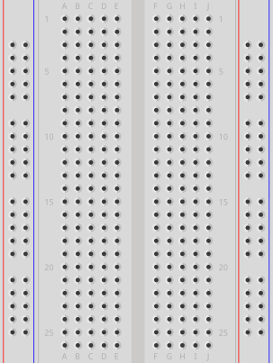
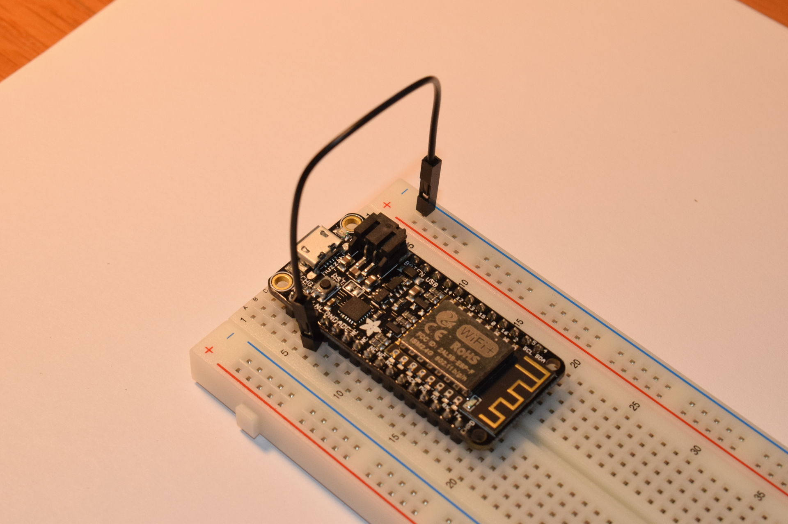
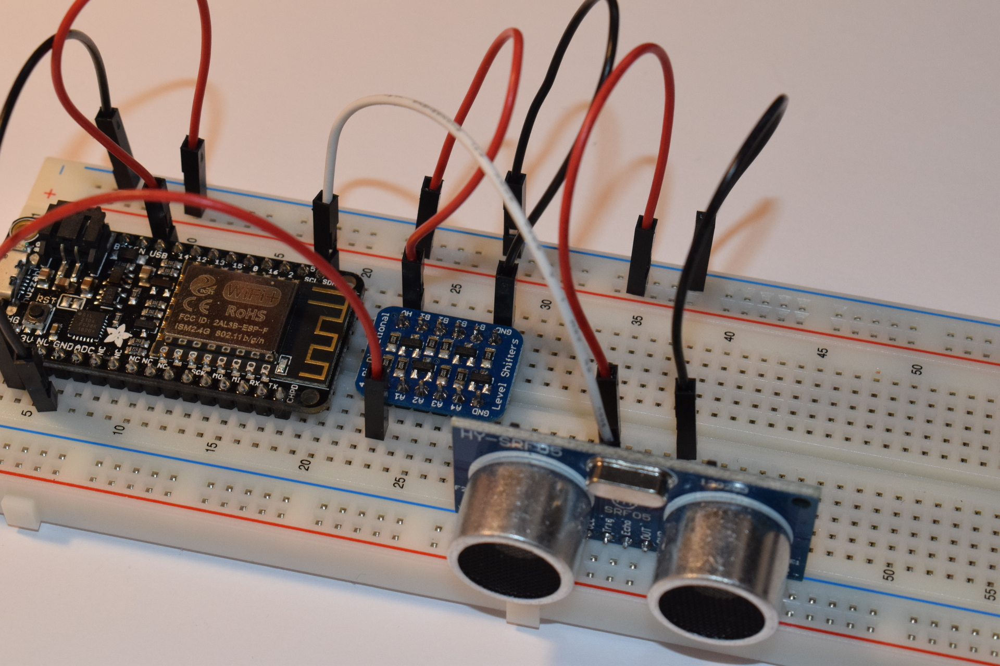
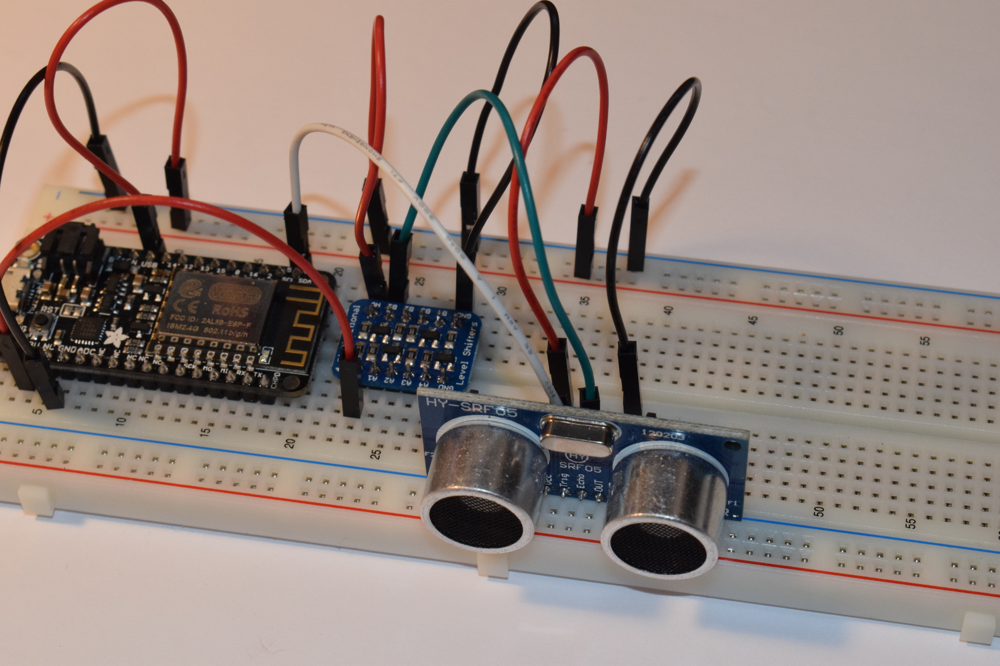
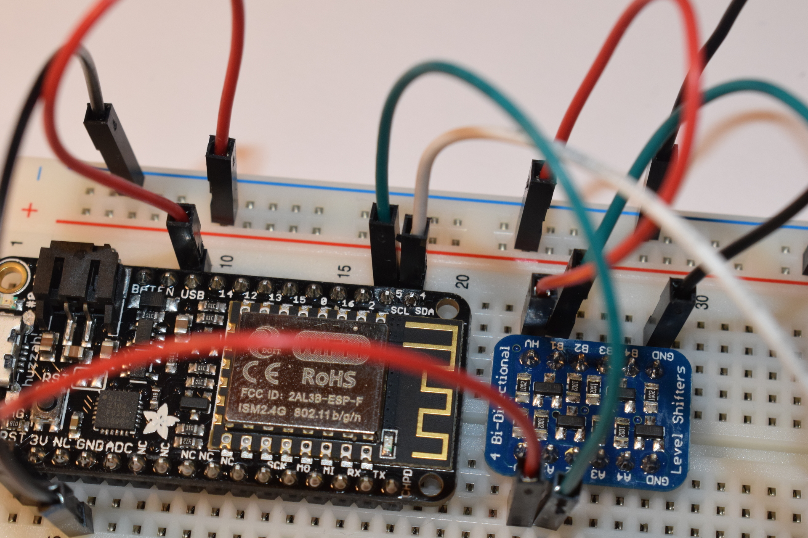
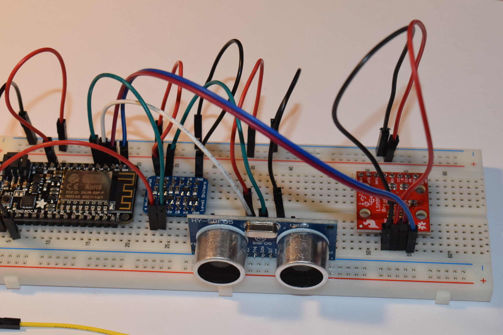

theme: ../cleaver-light

---


# Hello, (physical) world


--

### Arduino

```c++
void setup() {
    
}

void loop() {
    
}
```

--

### Arduino

```c++
// On the Arduino Uno, a LED is connected to pin 13
const LED_PIN = 13;

void setup() {
    // Configure the LED pin as an output
    pinMode(LED_PIN, OUTPUT);
}

void loop() {
    // Change the state of the pin, then wait 500 milliseconds
    digitalWrite(LED_PIN, HIGH);
    delay(500);
    digitalWrite(LED_PIN, LOW);
    delay(500);
}
```

--

# Introduction to electronics

--

### Ohms Law

[[(animated)
- More voltage → More current
>>
- More resistance → Less current
>>

But, we don't really have to care. In digital circuits, voltage is (usually) all that matters
]]


--

### Voltage

Disclaimer: i'm simplifying, physicists may get angry.


--

### Voltage

[[(animated)
- Voltage is a measure of electric potential
>>
- High voltage → flow of charge (current) to lower voltage
>>
- Voltage is distributed across a conductor
>>
- Everything is relative, including voltage
- We choose what a "high" voltage is by chosing what 0 volts is
>>
- The zero point is called "ground", because the earth can absorbe any charge
  us puny humans throw at it
>>
- Voltage is meaningless uneless there is a common reference
>>
    - **Connect your grounds**
]]

--

## Digital signals

Transmiting data

[[(animated)
>>
- Analog is unprecise and error prone
    - We don't want data to degrade because we used a long wire.
>>
- Let's make more arbitrary choices!
>>
- 0V is 0, some other voltage is 1
    - Round anything in between
]]

--


--


--


--

### What is 'high'


[[(animated)
>>
- 1.8 V
- **3.3 V**
- **5 V**
- 12 V
>>

Don't mix and match, keep the magic smoke inside the chips!
]]


--

# Programming electronics

--

### Programming electronics

We need something programable that can control electronics

--

### Raspberry PI


[[(animated)
>>
- Full-fledged computer
>>
- Runs linux
>>
- GPIO pins
]]

--

### Microcontrollers

[[(animated)
- Purely designed for physical interraction
>>
- Slower
    - 10-100 MHz
    - Low amounts of RAM
>>
- No operating system ⇒
    - Full control
    - Timing guarantees
    - No safeguards
    - No heap
>>
]]


--

### Arduino

A family of microcontrollers with common hardware and software to make embedded
deveolopment approachable.


[[(animated)
>>
- Programmed in C++
>>
- Using the arduino IDE
>>
- Libraries for most peripherals
]]

--

### What to chose

[[(animated)
>>
Advantages of a raspberry PI:

>>
- Built in Wifi and bluetooth
>>
- Plenty of linux tools
>>
- Easy to debug
>>
- Fast
>>
- Programmable in most languages

>>
And some disadvantages:

>>
- Needs some time to boot
>>
- No timing guarantees
>>
- Relatively large
>>
- No analog inputs
]]


--

### An LED on a Raspberry pi

No on-board LED, we'll have to make our own

[[(animated)

>>
- LEDs will use any current they can
>>
- But they can only take a few milliamps
>>

]]


--

### Ohms law again

I lied, we need it for this

[[(animated)
>>
- LEDs have a voltage drop
    - Depends on the colour, but typically ~2-3 V
]]

--

### Hooking things up




--

### Where to hook things up?

- Pinouts
- Datasheets


--

# Let's make something!
## An analog digital ruler

--
### The hardware

We'll be using a **adafruit feather huzzah esp8266**.

[[(animated)
>>
- Arduino or LUA
>>
- Built in wifi and bluetooth
>>
- Requires some setup in the IDE
>>
    - <a href="https://learn.adafruit.com/adafruit-feather-huzzah-esp8266/using-arduino-ide">Instructions</a>
]]

--

### Visualising distances using a servo

[[(animated)
A servo is a small motor where you can control the angle of the output.

>>
It is controlled using pulse width modulation (PWM)


]]


--

### Using it with Arduino

[[(animated)
- Duck it!
>>
- https://www.arduino.cc/en/Reference/Servo
>>
- Where to connect it?
>>
- <a href="https://learn.adafruit.com/adafruit-feather-huzzah-esp8266/pinouts/">Pinout</a>
    - Look for the *pwm pins*
]]


--


--



--


--


--


--


--


--

### Programming!

[[(animated)
>>
```c++
#include <Servo.h>

Servo servo;

int position = 0;

void setup() {
    // put your setup code here, to run once:

    servo.attach(12);
}

void loop() {
    position = (position + 10) % 180;

    servo.write(position);

    delay(1000);
}
```
]]

--

### Measuring distances

HY-SRF05 ultrasound distance sensor

[[(animated)
>>
- How does it work? Duck it
>>
- <a href="http://www.f15ijp.com/2012/09/arduino-ultrasonic-sensor-hc-sr04-or-hy-srf05/">Strange blog with examples</a>
>>
- ⚠ 5V ⚠
    - If input is 5V, chances are output is 5v
    - Check our microcontroller
>>
    - <a href="https://learn.adafruit.com/adafruit-feather-huzzah-esp8266/pinouts#logic-pins-2-7">Not 5v tolerant</a>
]]


--

### Logic level shifters

- <a href="https://www.electrokit.com/produkt/nivaomvandlare-4-kanaler-bidirektionell-i2c"/>We have this one</a>
- Connect LV to 3.3, HV to 5, GND to GND

--


--


--


--



--



--


--

### Programming!


```cpp
#include <Servo.h>

Servo servo;

const int TRIG_PIN = 4;
const int ECHO_PIN = 5;

void setup() {
    // put your setup code here, to run once:

    Serial.begin(9600);

    servo.attach(12);

    pinMode(TRIG_PIN, OUTPUT);
    pinMode(ECHO_PIN, INPUT);
    digitalWrite(TRIG_PIN, LOW);
}

void loop() {
    digitalWrite(TRIG_PIN, HIGH);
    delayMicroseconds(10);
    digitalWrite(TRIG_PIN, LOW);

    auto duration = pulseIn(ECHO_PIN, HIGH);

    auto distance = duration / 29.1 / 2;

    Serial.print(distance);
    Serial.println(" cm");
}
```


--

# Communication

--


### Encoding data

What's the difference between 1 and 111111?

[[(animated)
>>
- Predefined time for bits
>>
- Other wire that says "there is data"
>>
- There are standard protocols

>>

Libraries usually handle this for you
]]

--


### Protocol 1: UART (Universal asyncronous receiver-transmitter)

- TX and RX pins
- TX -> RX, RX->TX
- Baud rate, usually (9600 or 115200)


--

### Protocol 2: SPI (Serial Peripheral Interface)

[[(animated)
- CLK/SCK
- MOSI (Master Out Slave In)
- MISO (Master In Slave Out)
>>
- Sometimes chip select
]]

--

### Protocol 3: **I**inter **I**nterconnected **Circuit** I²C

[[(animated)
- SCL (Clock)
- SDA (Data)
>>

- One *master*, multiple *slaves* on the same bus
- Address of target starts communication
]]


--

# An I²C innertial measurement unit

--

### Sparkfun LSM9DS1

- Search it!
- <a href="https://learn.sparkfun.com/tutorials/lsm9ds1-breakout-hookup-guideHookup guide">Hookup guide</a>
- Can do both SPI and I²C, I²C seems easier
- Where to hook up?
    - Check the huzzah pinout

--


--



--




--

### Code

https://gist.github.com/TheZoq2/d2ae78f44f63a55459a5e0a5c0ec7e57


--

### Input

- A completely unconnected pin is *floating* and will have a nonsense value
- Always connect inputs to a known value
- Pull up/push down resistors do this


--

### The end


Slides are at http://thezoq2.github.io/Presentations


## See you at the hackathon


